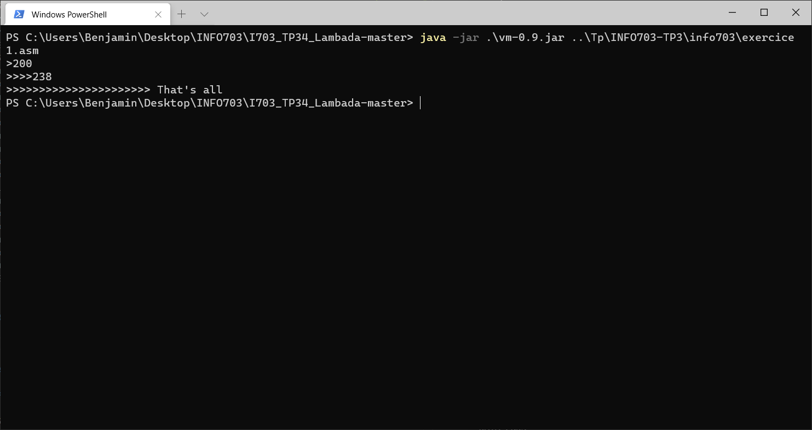
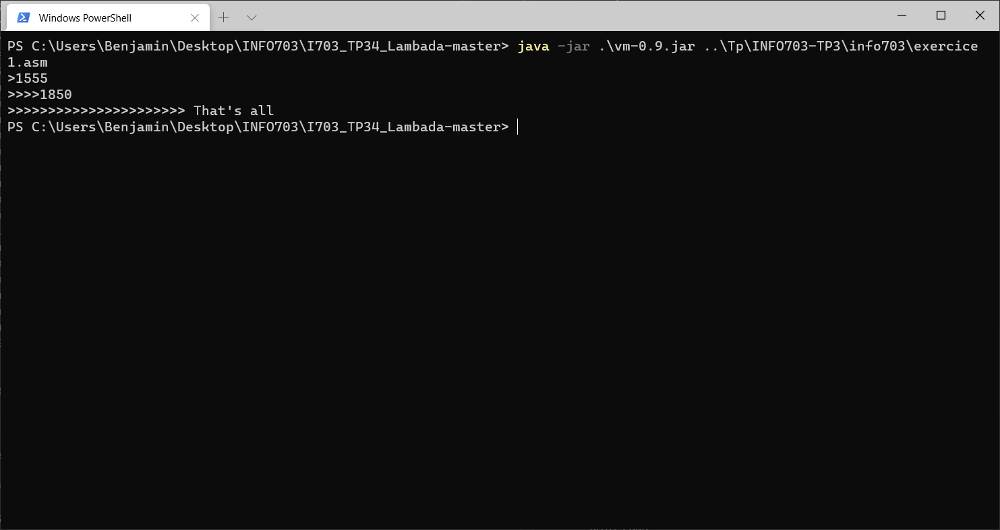
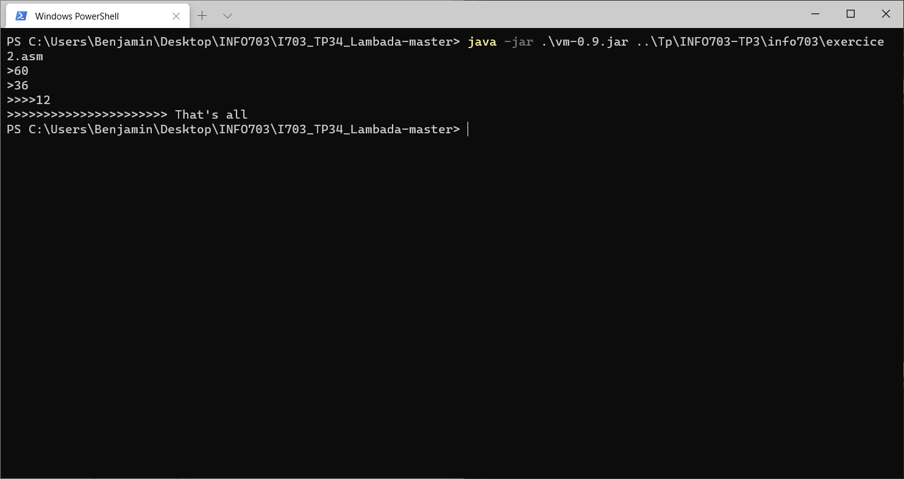
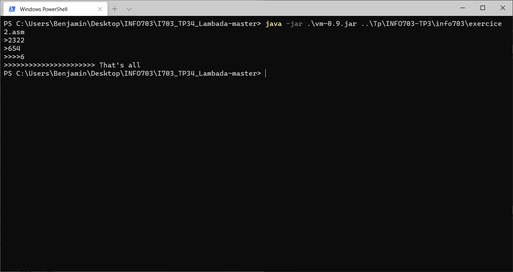
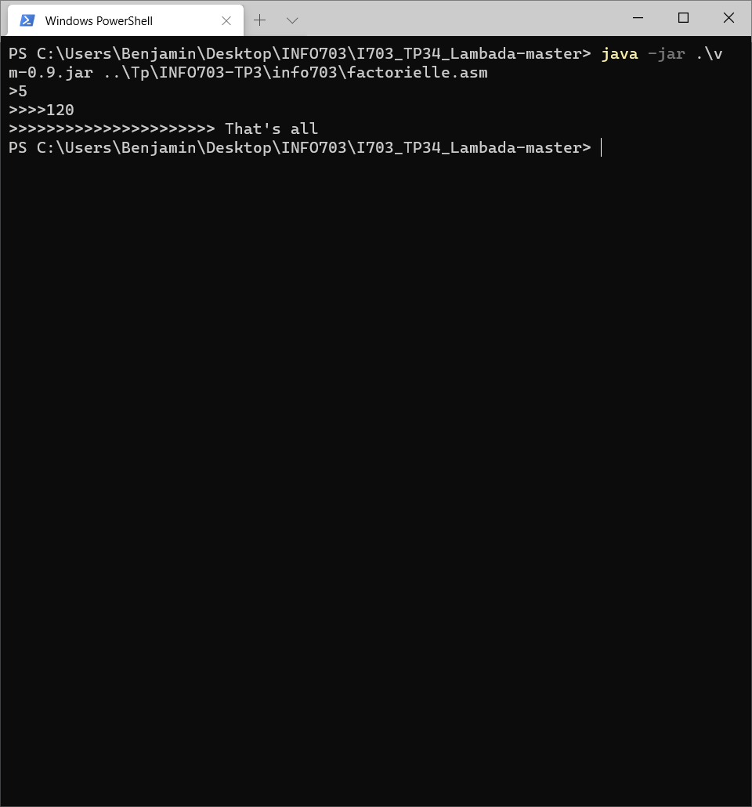

KITSCHMINYOF Stephan

GALLET Benjamin

M1-INFO     GRP-2

# TP Compilation

## Compte-rendu TP 3-4

## Exercice 1 :

### Programme source :

~~~
let prixHt = input;
let prixTtc =  prixHt * 119 / 100 .
~~~

### Code généré avec notre version du générateur pour la machine à registre :

#### Fichier Exercice1.asm
~~~
DATA SEGMENT
	prixHt DD
	prixTtc DD
DATA ENDS
CODE SEGMENT
    in eax
    mov prixHt, eax
    push eax
    mov eax, prixHt
    mov ebx, 119
    mul eax, ebx
    push eax
    mov eax, 100
    pop ebx
    div ebx, eax
    push ebx
    pop eax
    mov prixTtc, eax
    push eax
    mov eax, prixTtc
    out eax
CODE ENDS
~~~

#### Résultats :
On peut donc tester le programme produit ett verfifier que l'on obtient bien les bon résultats.

Sur cette première capture on rentre donc le nombre "200" on obtient donc en résultat 238 -> 200 * 119 / 100

Sur la deuxième capture on obtient 1850 -> 1555 * 119 / 100 

## Exercice 2 :

### Programme source :

~~~
let a = input;
let b = input;
while (0 < b)
do (let aux=(a mod b); let a=b; let b=aux );
output a
.
~~~

### Code généré :

#### Fichier Exercice2.asm
~~~
DATA SEGMENT
	a DD
	b DD
	aux DD
DATA ENDS
CODE SEGMENT
    in eax
    mov a, eax
    push eax
    in eax
    mov b, eax
    push eax
debut_while_1:
    mov eax, 0
    mov ebx, b
    sub eax, ebx
    push eax
    pop eax
    jle faux_gt_1
    mov eax,1
    jmp sortie_gt_1
faux_gt_1:
sortie_gt_1:
    jz sortie_while_1
    mov eax, b
    push eax
    mov eax, a
    pop ebx
    mov ecx,eax
    div ecx,ebx
    mul ecx,ebx
    sub eax,ecx
    push eax
    pop eax
    mov aux, eax
    push eax
    mov eax, b
    mov a, eax
    push eax
    mov eax, aux
    mov b, eax
    push eax
    jmp debut_while_1
sortie_while_1:
    mov eax, a
    out eax
CODE ENDS
~~~

### Résultats :

Ce programme permetant de calculer le PGCD de deux nombre qui sont entrés dans la console on remarque sur les deux capture suivantes que le résultat corespond bien au résuktats trouvé par la machine à registre.

PGCD(60,36) -> 12

PGCD(2322,654) -> 6

## Tests compémentaires :

### Programme Factorielle

Ce programme va permettre de calculer la factorielle du nombre entré.

### Programme source :

~~~
let a = input;
let b = 1;
let c = 1;
if (a < 1) or (a < 2)
then (output b)
else (let c = 2;
(while (b < a) do (let b = (b + 1); let c = (c * b);)); (output c)).
~~~

### Code généré :

#### Fichier factorielle.asm
~~~
DATA SEGMENT
	a DD
	b DD
	c DD
DATA ENDS
CODE SEGMENT
    in eax
    mov a, eax
    push eax
    mov eax, 1
    mov b, eax
    push eax
    mov eax, 1
    mov c, eax
    push eax
debut_if_1:
    mov eax, a
    mov ebx, 1
    sub eax, ebx
    push eax
    pop eax
    jl vrai_gt_1
    push 0
    jmp fin_gt_1
vrai_gt_1:
    push 1
fin_gt_1:
sortie_gt_1:
debut_while_2:
    mov eax, b
    mov ebx, a
    sub eax, ebx
    push eax
    pop eax
    jl vrai_gt_2
    push 0
    jmp fin_gt_2
vrai_gt_2:
    push 1
fin_gt_2:
faux_gt_2:
sortie_gt_2:
    jz sortie_while_2
    mov eax, b
    mov ebx, 1
    add eax, ebx
    push eax
    pop eax
    mov b, eax
    push eax
    mov eax, c
    mov ebx, b
    mul eax, ebx
    push eax
    pop eax
    mov c, eax
    push eax
    jmp debut_while_2
sortie_while_2:
    mov eax, c
    out eax
    jmp sortie_if_1
faux_gt_1:
    mov eax, b
    out eax
sortie_if_1:
CODE ENDS
~~~

### Résultats :

10! -> 3 628 800

5! -> 120

